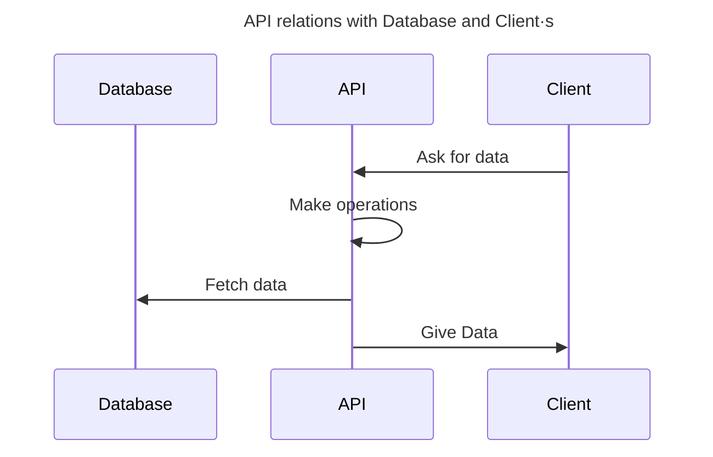

# API
Application Programming Interface

## Project
C# Application server for Area project.

It uses [dotnet](https://dotnet.microsoft.com/en-us/learn) and is the interface between the front (web and mobile) and the database.

### Database

## Commands
The commands should be in the AREA_ReST_API folder

| Command          | Result                                          |
| ---------------- | ----------------------------------------------- |
| `dotnet restore` | Restores the dependencies and tools of a project |
| `dotnet build` | Builds a project and all of its dependencies |
| `dotnet test` | .NET test driver used to execute unit tests. |
